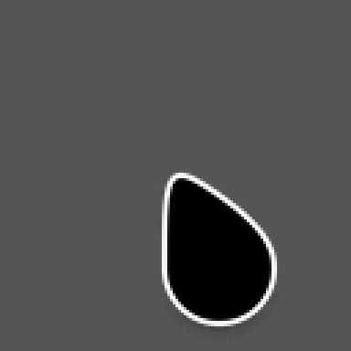

# Animated Oreo Cursors

Reversible cursor transitions for patched Niri. See [TRANSITIONS.md](TRANSITIONS.md)
for building, previews, installation, and the filename convention.

## Transition previews

All 19 unique transitions are shown below. Each plays in both directions;
resize and move aliases share these assets, covering 38 named pairs.

Previews play at one-quarter speed, with pauses at the endpoints.
Actual transitions last 120 ms. The busy-cursor previews show the morph only;
the normal spinner animation starts afterward in Niri.

Centered shapes use a hotspot at the top of their visible outline, keeping
them better aligned with the arrow and pointing hand during morphs. This also
applies to normal cursors: the text cursor's click point is at its top, not its center.

| | | |
| --- | --- | --- |
| **Arrow / Link hand**<br> | **Arrow / Text**<br> | **Link hand / Text**<br> |
| **Arrow / Horizontal resize**<br> | **Arrow / Vertical resize**<br> | **Arrow / NE/SW resize**<br> |
| **Arrow / NW/SE resize**<br> | **Arrow / Column resize**<br> | **Arrow / Grab**<br> |
| **Grab / Grabbing**<br> | **Arrow / Grabbing**<br> | **Arrow / Progress**<br> |
| **Arrow / Wait**<br> | **Grabbing / Copy**<br> | **Grabbing / Not allowed**<br> |
| **Grabbing / No drop**<br> | **Arrow / Crosshair**<br> | **Text / Vertical text**<br> |
| **Zoom in / Zoom out**<br> |  |  |

The original Oreo sources and license are preserved below.

# Oreo Cursors 


https://www.pling.com/p/1360254/

### Install build version 📦

The cursors can also be found under dist/ directory. Copy them to ~/.icons/ (only available to $USER) or /usr/share/icons/ (available to all users).

Alternatively run `make install` as root to copy them to /usr/share/icons.

### Manual Install 📦

1. Install dependencies 

    - git
    - make
    - ruby >= 2.4
    - inkscape
    - xcursorgen

2. Run the following commands as a regular non-root user

    ```
    git clone https://github.com/varlesh/oreo-cursors.git
    cd oreo-cursors
    make build
    
    # installs the cursor to /usr/share/icons/
    # To uninstall, remove the /usr/share/icons/oreo_* directories
    sudo make install 
    ```

⚠️ Note that on an i3 desktop processor, this might take 45 minutes to build 20 cursors with all the sizes given.

⚠️ You can avoid building and just install what's already built by us!

3. Choose a theme in the Settings or in the Tweaks tool.

### Generate user defined colours and sizes 🎨

1. Edit the file cursors.conf with colour name and colour value in hex:

```
black_mod = color: #424242, label: #FFF, shadow: #222, shadow-opacity: 0.4, stroke: #fff, stroke-opacity: 1, stroke-width: 1

# Lines with # are skipped.

Also read the comments in cursors.conf for more details.
```

To add custom size, use:

```
sizes = 24, 32, 40, 48, 64
```

(`make build` automatically runs all the necessary files)

⚠️ More sizes means more time to build. It can take upto an hour to build 5 - 6 sizes.

⚠️ More sizes also means more disk space .

2. Follow [Manual Install](https://github.com/Souravgoswami/oreo-cursors#manual-install) for build and installation.
